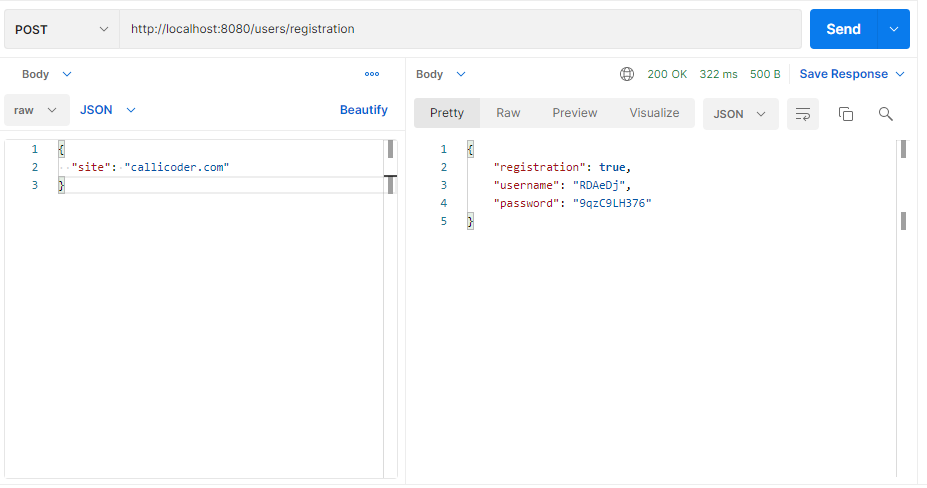
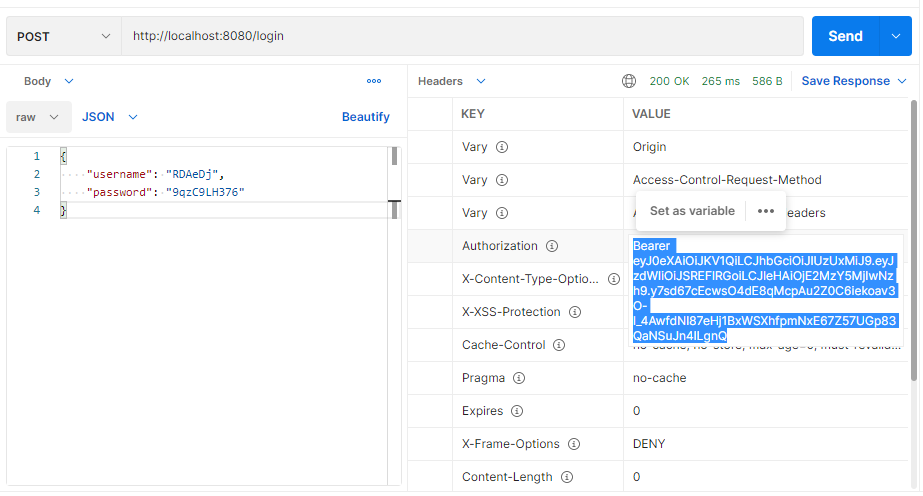
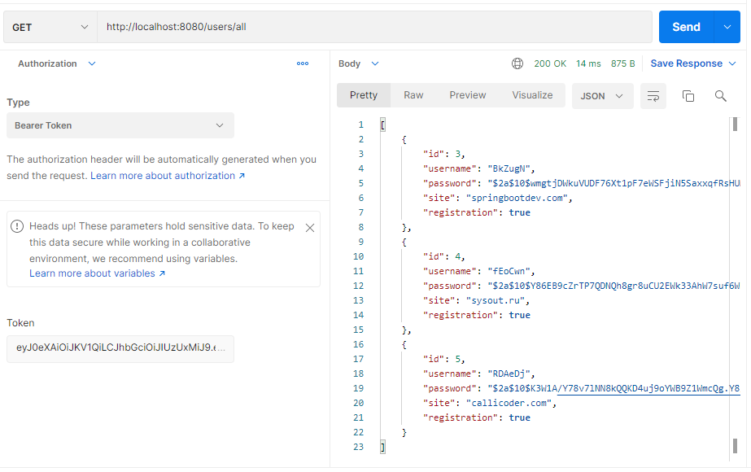
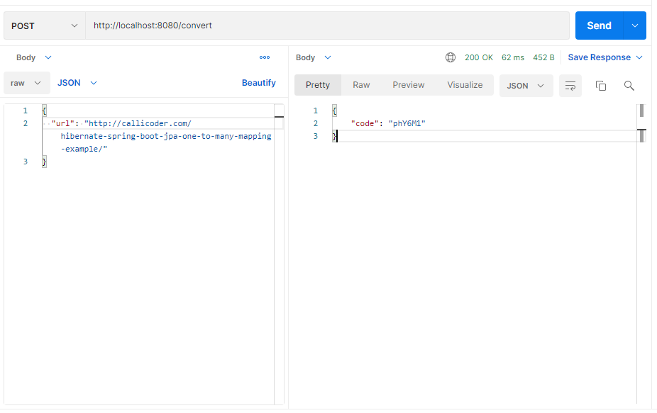
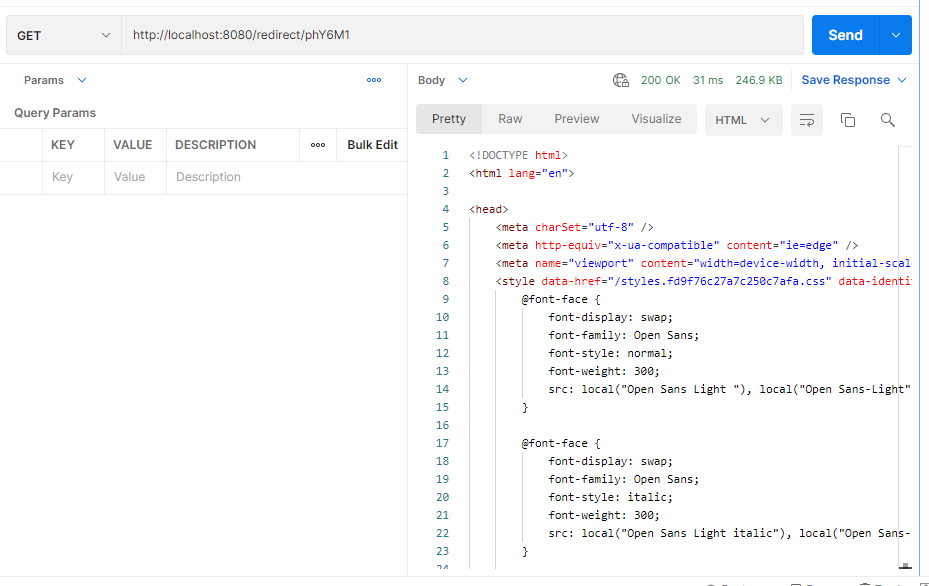
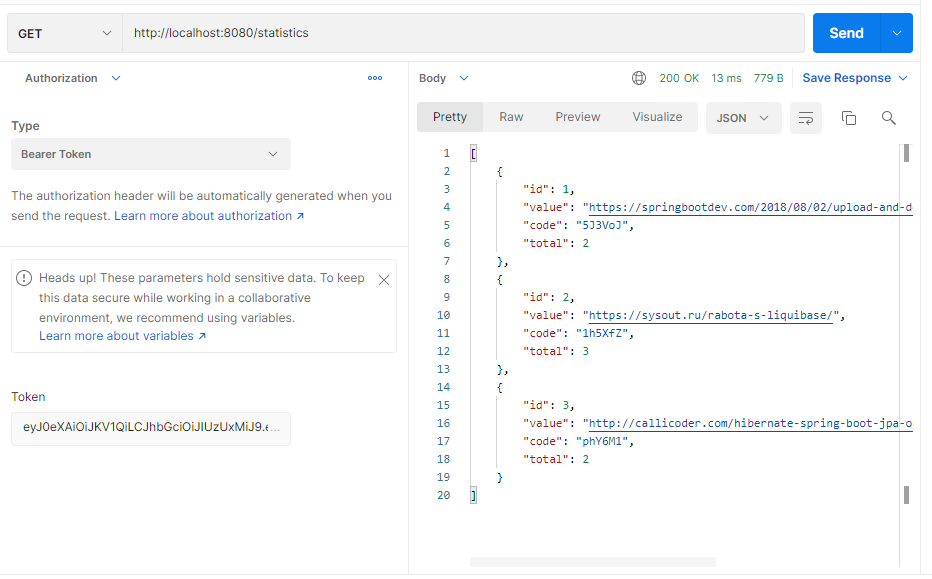

Сервис - UrlShortCut
=========================================

**О проекте:**
==
Проект представляет собой сервис быстрого доступа к URL-адресам.
Пользователь регистрирует свой сайт, конвертирует свои собственные ссылки с помощью данного сервиса и вставляет их в любом месте.
Перенаправление происходит через данный сервис, который подсчитывает клики по ссылкам.

**Используемые технологии:**
==
- Java 12
- Spring Boot 2
- Spring Security & JWT authorization
- Spring Data JPA
- PostgreSQL

**Как запустить приложение через docker-compose**
==
1. Собрать образ приложения:
docker build -t shortcut .

2. Запустить кластер базы данных в отдельном контейнере:
docker run -d --name postgres \
-e POSTGRES_PASSWORD=password \
-e PGDATA=/var/lib/postgresql/data/pgdata \
-p 5433:5432 \
-v postgres_db:/var/lib/postgresql/data \
postgres

3. Создать базу данных для приложения:
3.1. Подключиться к кластеру изнутри контейнера:
docker exec -it postgres bash
3.2. Открыть psql:
psql -U postgres
3.3. Создать базу данных:
CREATE DATABASE shortcut;

4. Запустить скрипт docker-compose
docker-compose up

**REST API запросы:**
==
Регистрация нового сайта, получение логина и пароля

Вход в систему под логином и паролем, получение токена

Список зарегистрированных сайтов

Генерация ссылки

Переадресация с использованием новой ссылки

Статистика переходов по сгенерированным ссылкам

**Контакты:**
==

